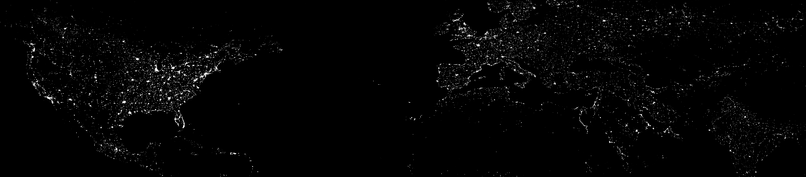

<h1>Hi, I'm Jonai!  <a href="https://github.com/joshmadakor1">Ethical Hacker</a>, <a href="https://www.linkedin.com/in/joshmadakor/">Cybersecurity Professional</a>, <a/h1> <a href="https://www.linkedin.com/in/joshmadakor/">SOC Analyst</a>

## 🧑‍💻🔐 Featured Cybersecurity Projects

### **📊 SIEM | Microsoft Sentinel | Live Cyber Attacks Mapping | Security Analyst**
- [View Project](https://github.com/JonaiSerrano/Designing_Azure_Sentinel_SIEM-Live-Attack-Map-Monitoring-)
- **Project Highlights:**
  - *Automated metadata extraction from Windows Event Viewer using PowerShell scripting*
  - *Integration of third-party geolocation APIs for IP-based location resolution*
  - *Configuration of Azure Log Analytics Workspace to enable geographic data visualization*
  - *Security event analysis and threat detection leveraging Azure Sentinel (Microsoft’s cloud-native SIEM)*
   
---
      
### **🔐 Windows Server Exploitation | MS17-010 | EternalBlue | Ethical Hacking**
- [View Project](https://tmkamal.github.io/under-construction-template/)
- **Project Highlights:**
  - Exploitation of SMBv1 vulnerability on Windows Server 2008
  - Use of AutoBlue tool for semi-manual attack execution
  - Network reconnaissance with `nmap`, and remote access via `netcat`

---

### **🌐 Website Hacking | Metasploitable | XSS & SQL Injection | Home Lab**
- [View Project](https://tmkamal.github.io/under-construction-template/)
- **Project Highlights:**
  - Deployment of Metasploitable server for web app vulnerability testing
  - Execution of JavaScript and SQL payloads for XSS and SQLi
  - Identification of attack vectors and mitigation strategies

---

### **🖥️ Windows System Takeover | Metasploit Framework | Reverse Shells**
- [View Project](https://tmkamal.github.io/under-construction-template/)
- **Project Highlights:**
  - Reverse shell engineering and remote access via Meterpreter
  - System manipulation: webcam spying, keystroke logging, screen sharing
  - Resource exfiltration and payload delivery using Metasploit tools

---

<h2> 🤳 Connect with me:</h2>

[][youtube]
[][X]
[][linkedin]
[][instagram]

[X]: https://x.com/Prometheus_CIA
[youtube]: https://www.youtube.com/@Jonaithesecurityguy
[instagram]: https://www.instagram.com/jonai_the_security_guy/
[linkedin]: https://www.linkedin.com/in/jonai-serrano-350480174/
